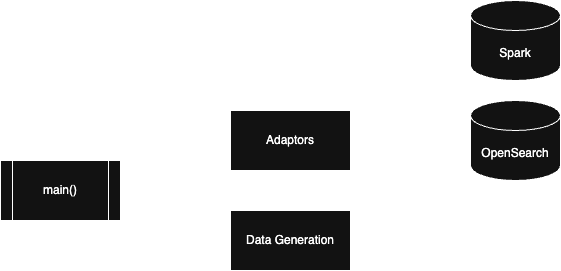

# Architecture for the Spec Testing Framework

- **adaptors** contains everything for running queries on different environments. The central class
  is `QueryableAdaptor` (defined in `__init__.py`), which has a minimal set of methods that any
  adaptor should support. For convenience, `context.py` defines a `context` wrapper that starts and
  tears down a unique querying environment per-test. Aside from those, each file contains a unique
  adaptor implementation.
- **data_generation** contains everything related to data generation, particularly `OpenSearchIndex`
  and `generate_index()`.

